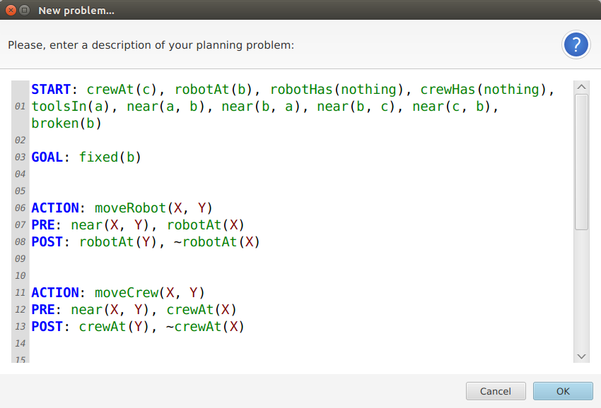

# LambdaPrism

*Scala OOP-FP pragmatic library for Artificial Intelligence*

# Introduction

*Intelligent systems* are more and more widespread: as technology evolves, we need original solutions to handle data, to connect systems, to create models - more generally, to solve problems; disciplines like *Artificial Intelligence* and *Operations Research* constitute different aspects of a multifaceted tool that we can employ to tackle complexity in a formal but creative way.

**LambdaPrism** is an open source Scala library based on both OOP (Object-Oriented Programming) and FP (Functional Programming) to provide a taxonomy for expressing AI concepts, especially in the sectors of pattern matching and planning: it is designed to be part of the new kernel of [GraphsJ](http://gianlucacosta.info/GraphsJ/), a container application for graph algorithms, but it can also be referenced as a standalone library.

Finally... there is more! :ghost: LambdaPrism is first of all a *pragmatic playground* (with no claims of completeness, but still *very* tested) for learning more about functional techniques applied to Artificial Intelligence: list processing, pattern matching, higher-order functions, currying, tail recursion and many more ideas (including ANTLR grammars), always trying to get the best of the OOP and the FP worlds! ^\_\_^

## Requirements

Scala 2.11.8 or later and Java 8u91 or later are recommended to employ LambdaPrism.

## Core concepts

LambdaPrism's root package is **info.gianlucacosta.lambdaprism** and contains the following main subpackages:

* **logic.basic.formulas**: a taxonomy of case classes and interfaces to easily express logic structures, in a *very* simplified model. Its basic building blocks are **Constant**, **Variable**, **CompoundFunctor** and **Literal**.

* **logic.basic.matching**: **SymbolicMatch.unify()** takes 2 literals and unifies them, returning a **SymbolicMatch** object if the *unification algorithm* succeeds. Within SymbolicMatch, **Environment** describes the constraints (expressed as **BindingGroup** objects) enforced by the match. In this basic logic model, *we assume that a variable can only be bound to a constant or another variable*.

* **planning.problem**: provides classes and interfaces to model a planning problem; in particular:
  * **Problem** contains one or more **Action** instances, especially **StartAction**, **GoalAction** and **MainAction**'s.

  * A **Step** is a specific reification of an action - to create a Step object, it is required to call the *reify()* method of its source Action

  * **ProblemValidators** includes basic validation functions as well as **CompositeValidator**, which executes a list of validators

* **planning.problem.parser**: **ProblemParser** reads a problem from different sources (for now, a Reader and a String). The language for describing a problem is very simple and minimalist - expressed by [this ANTLR grammar](src/main/antlr/PlanningProblem.g4)

* **planning.problem.dialog**: **ProblemDialog** is a ScalaFX dialog employing [OmniEditor](https://github.com/giancosta86/OmniEditor) to ask users to input a planning problem. The most straightforward way to use it is **ProblemDialog.askForProblem()**.

* **classification.basic**: its **ClassificationProblem** class (that can also be instantiated via **ClassificationProblemParser**) describes a simple classification problem and provides a *getView()* method to obtain a filtering **ClassificationView** on one of its *attributes*; in turn, such view contains a *createDecisionTree()* method creating a **DecisionTree** - which, in this basic package, only has one level of **DecisionTreeLeaf** leaves.

For further information, the documentation is available in Scaladoc format and can be downloaded from [the library's section in Hephaestus](https://bintray.com/giancosta86/Hephaestus/LambdaPrism). Finally, the full open source code is available on its [GitHub project page](https://github.com/giancosta86/LambdaPrism).

## Referencing the library

LambdaPrism is available on [Hephaestus](https://bintray.com/giancosta86/Hephaestus) and can be declared as a Gradle or Maven dependency; please refer to [its dedicated page](https://bintray.com/giancosta86/Hephaestus/LambdaPrism).

Alternatively, you could download the JAR file from Hephaestus and manually add it to your project structure.

Finally, LambdaPrism is also a standard [OSGi](http://www.slideshare.net/giancosta86/introduction-to-osgi-56290394) bundle which you can employ in your OSGi architectures! ^\_\_^

## Special thanks

Special thanks to:

* [Prof.ssa Michela Milano](http://ai.unibo.it/people/MichelaMilano) for her valuable advice and suggestions

## Further references

* [GraphsJ](https://github.com/giancosta86/GraphsJ)

* [OmniEditor](https://github.com/giancosta86/OmniEditor)

* [Helios-fx](https://github.com/giancosta86/Helios-fx)

* [Scala](http://scala-lang.org/)

* [ScalaFX](http://scalafx.org/)

* [ANTLR](http://www.antlr.org/)
